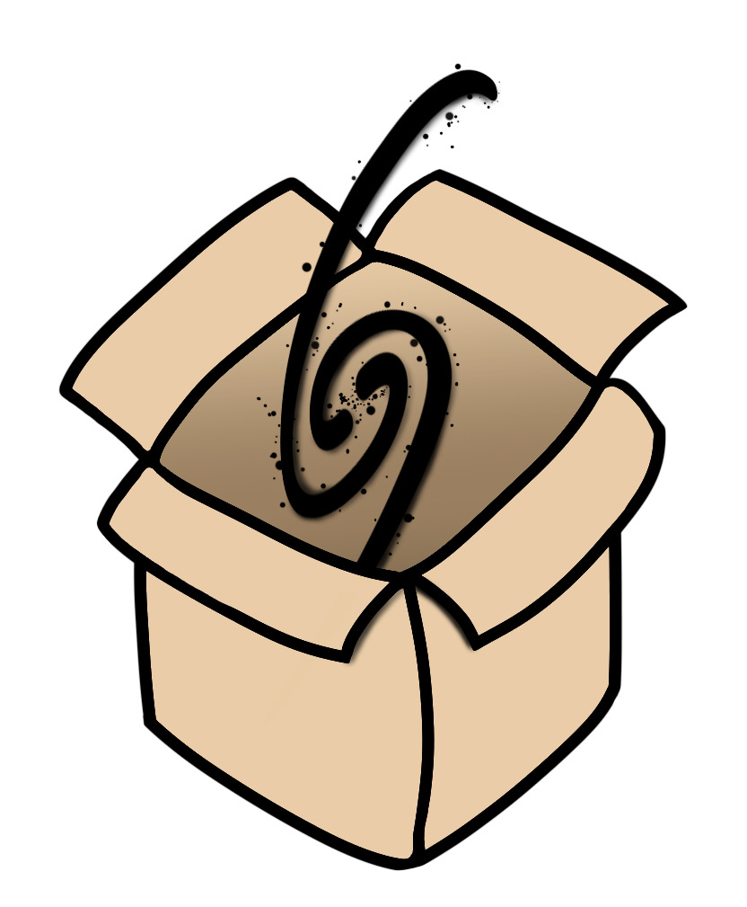

## Projects

### Galaxy-in-a-box

Our database is used in *a large scale galactic model of emission from active star forming regions*, the so-called galaxy-in-a-box model. For more details on this project please visit the webpage (in prep.), GitHub repository (in prep.) or publication (Dutkowska & Kristensen 2022, in press).
