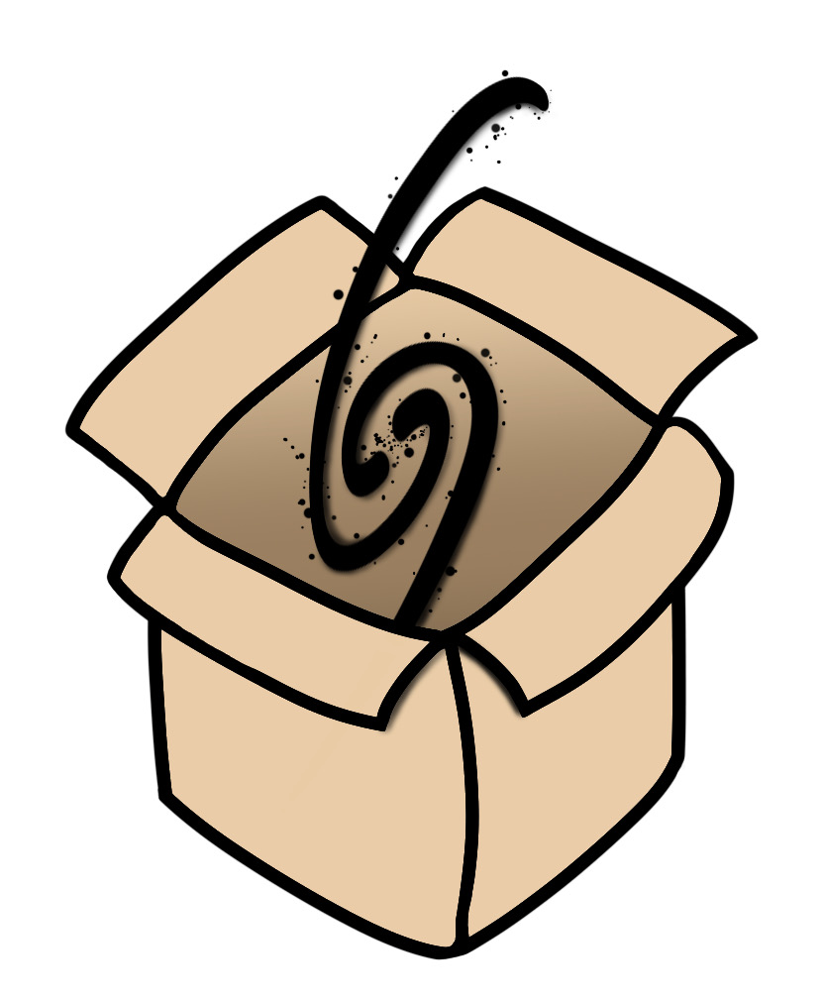

## Projects

### Galaxy-in-a-box

<em>Galaxy-in-a-Box</em> is a model that predicts galactic-scale emission from active star formation based on the properties of
protostellar outflows. In its current form, it focuses on the water line emission at 987.9 GHz
(H2O 202–111) and examines whether this line can trace star-forming activity across cosmic environments.
However, the framework could be applied to any molecule for which there is solid observational evidence linking its
emission to protostellar outflows and a substantial number of observational data points.

The ultimate goal is to connect the emission from outflows—key signposts of active star formation—with what we observe
on larger, integrated scales, where stellar feedback shapes the surrounding medium. This allows us to ask questions such as:
“How much of the observed galactic emission originates from outflows?” and “Can we use this to characterize the star-formation
activity of a galaxy—or even disentangle the components that make up its total emission?”

So far, <em>Galaxy-in-a-Box</em> (and, by extension, the WED framework) has shown that the total H2O emission is primarily
governed by the star-formation efficiency and the adopted free-fall-time scaling, with only a minor dependence on the IMF
and molecular-cloud mass function
(<a href="https://www.aanda.org/articles/aa/full_html/2022/11/aa43235-22/aa43235-22.html">Dutkowska &amp; Kristensen 2022, A&amp;A 667, A135</a>).
A subsequent study linked water-line and far-infrared luminosities to star-formation rates and demonstrated that
additional physical processes are required to reproduce the brightest systems
(<a href="https://www.aanda.org/articles/aa/full_html/2023/06/aa45336-22/aa45336-22.html">Dutkowska &amp; Kristensen 2023, A&amp;A 674, A95</a>).

While independent from WED, the project benefits from the same empirical foundation by testing how the statistical
behaviour of water emission observed in protostellar environments translates to integrated galactic scales.
Code and documentation are available on
<a href="https://github.com/katarzynadutkowska/galaxy-in-a-box">GitHub</a>.

